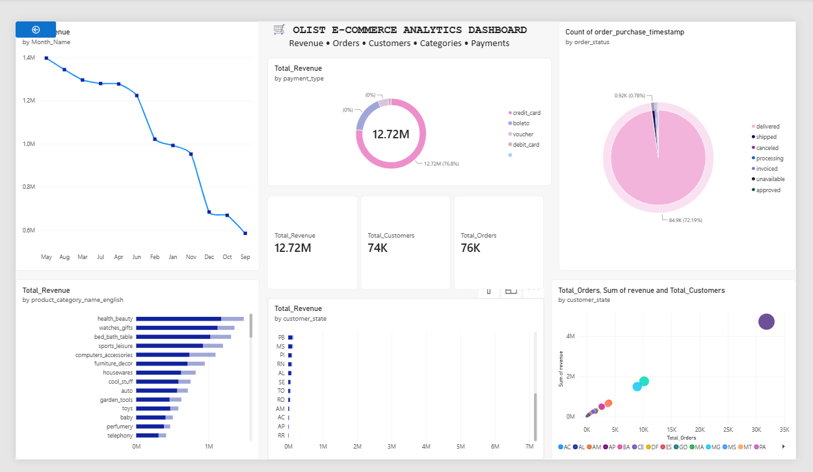

# 📊 Olist E-Commerce Analytics Dashboard

## 📌 Project Overview

This project presents an interactive **E-Commerce Sales Analytics Dashboard** built using **Power BI** and the **Olist Brazilian E-Commerce Dataset**.

The dashboard provides insights into:

* Revenue Performance
* Customer Behavior
* Order Trends
* Payment Preferences
* Product Performance
* Geographic Sales Distribution

The primary objective of this project is to demonstrate:

* Data Cleaning & Preparation
* Data Modeling
* SQL Analysis
* DAX Calculations
* Business Intelligence Reporting
* Dashboard Design

---

## 🎯 Business Objectives

* Analyze overall business performance.
* Identify top-performing product categories.
* Understand customer purchasing behavior.
* Track order fulfillment status.
* Analyze payment method preferences.
* Discover high-revenue states and regions.
* Generate actionable business insights.

---

## 🛠️ Tools & Technologies Used

* Power BI
* SQL
* DAX
* Microsoft Excel
* CSV Dataset
* Data Cleaning & Transformation
* Business Intelligence & Visualization

---

## 📂 Dataset Information

### Dataset:

**Olist Brazilian E-Commerce Dataset**

The dataset contains information related to:

* Customers
* Orders
* Products
* Payments
* Reviews
* Sellers
* Geolocation Data

---

# 📈 Dashboard Features

## 1️⃣ Revenue Trend Analysis

Tracks total revenue over time to identify:

* Sales patterns
* Growth trends
* Seasonal fluctuations

---

## 2️⃣ Payment Method Analysis

Revenue contribution by payment methods:

* Credit Card
* Boleto
* Voucher
* Debit Card

---

## 3️⃣ Order Status Distribution

Monitor order lifecycle performance:

* Delivered
* Shipped
* Processing
* Approved
* Cancelled
* Unavailable

---

## 4️⃣ KPI Cards

| KPI                | Value   |
| ------------------ | ------- |
| 💰 Total Revenue   | 12.72M+ |
| 👥 Total Customers | 74K+    |
| 📦 Total Orders    | 76K+    |

---

## 5️⃣ Product Category Performance

Top-performing product categories:

* Health & Beauty
* Watches & Gifts
* Bed Bath & Table
* Sports & Leisure
* Computers & Accessories

---

## 6️⃣ State-wise Revenue Analysis

Analyze revenue contribution across Brazilian states to identify:

* High-performing regions
* Revenue concentration
* Regional demand patterns

---

## 7️⃣ Revenue vs Orders Analysis

Scatter plot analysis showing relationships between:

* Revenue
* Orders
* Customers

---

# 📊 Key Insights

## 💰 Revenue Performance

* Generated over **12.7 Million** in total revenue.
* Majority of transactions were completed using **Credit Cards**.

### Revenue Trend


---

## 📦 Order Fulfillment

* More than **97% of orders** were successfully delivered.
* Cancelled and unavailable orders represent only a small percentage.

### Order Status Distribution


---

## 🛍️ Product Performance

* **Health & Beauty** emerged as the highest revenue-generating category.
* Lifestyle and home-related products consistently performed well.

### Product Category Revenue


---

## 🌎 Geographic Analysis

* Certain Brazilian states contribute significantly higher revenue than others.
* Revenue concentration indicates strong regional demand.

---

# 📸 Dashboard Preview

## 📊 Power BI Dashboard

<p align="center">
    
</p>

---

# 🧮 DAX Measures Used

### Total Revenue

```DAX
Total_Revenue =
SUM(payments[payment_value])
```

### Total Orders

```DAX
Total_Orders =
DISTINCTCOUNT(orders[order_id])
```

### Total Customers

```DAX
Total_Customers =
DISTINCTCOUNT(customers[customer_unique_id])
```

### Revenue Per Customer

```DAX
Revenue_Per_Customer =
DIVIDE(
    [Total_Revenue],
    [Total_Customers]
)
```

---

# 🚀 Project Outcomes

This project demonstrates:

✔ Data Cleaning & Preparation

✔ Data Modeling

✔ SQL Analysis

✔ DAX Calculations

✔ Business KPI Development

✔ Dashboard Design

✔ Data Visualization

✔ Business Insight Generation

---

# 📁 Repository Structure

```text
Olist-Ecommerce-Dashboard/
│
├── data/
│   ├── raw_data.csv
│   └── cleaned_data.csv
│
├── dashboard/
│   ├── dashboard.pbix
│   ├── dashboard1.png
│   ├── category_revenue.png
│   ├── order_status.png
│   └── revenue_trend.png
│
├── sql/
│   └── ecommerce_analysis.sql
│
└── README.md
```

---

# 👩‍💻 Author

**Yashika Garg**

Data Analytics | SQL | Power BI | Python

GitHub: https://github.com/yashika-34

---

⭐ If you found this project useful, don't forget to star the repository!

This dashboard showcases the complete **Data Analytics workflow** from data preparation to business intelligence reporting using real-world e-commerce data. 🚀
