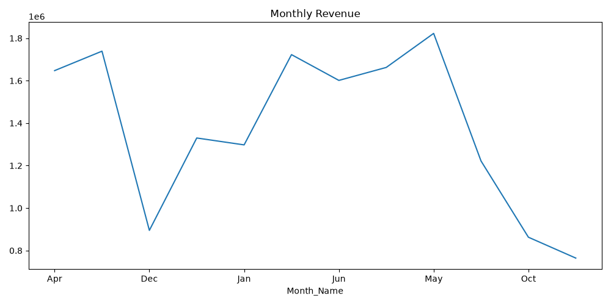
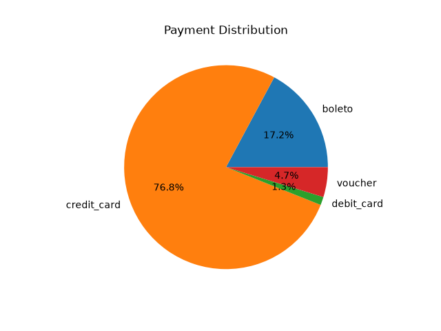
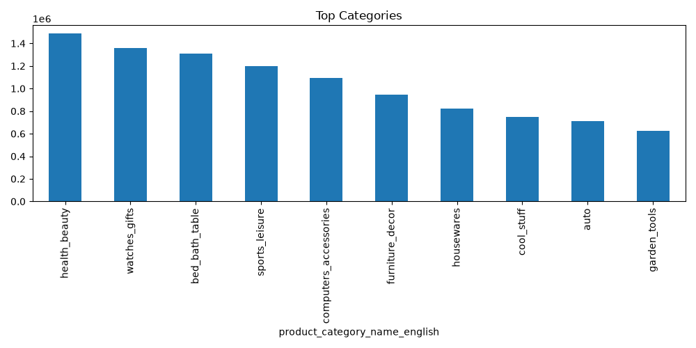
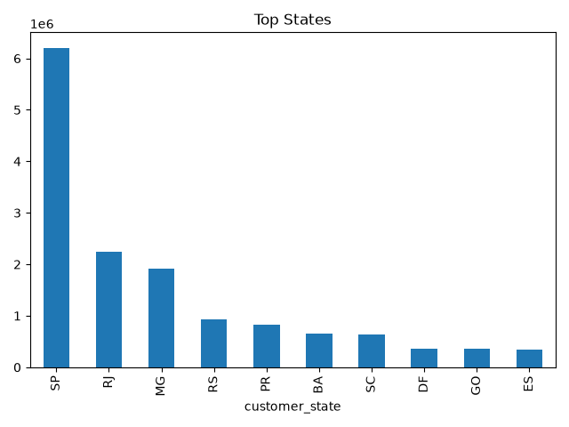

# 📊 Olist E-Commerce Analytics Dashboard

## 📌 Project Overview

This project presents an interactive **E-Commerce Sales Analytics Dashboard** built using **Power BI** and the **Olist Brazilian E-Commerce Dataset**.

The dashboard provides insights into revenue performance, customer behavior, order trends, payment preferences, product performance, and geographical sales distribution.

The objective of this project is to demonstrate real-world **Data Analytics**, **SQL**, **DAX**, **Data Modeling**, and **Business Intelligence** skills required for a Data Analyst role.

---

## 🎯 Business Objectives

- Analyze overall business performance.
- Identify top-performing product categories.
- Understand customer purchasing behavior.
- Track order fulfillment status.
- Analyze payment method preferences.
- Discover high-revenue states and regions.
- Generate actionable business insights.

---

## 🛠️ Tools & Technologies Used

- Power BI
- SQL
- DAX
- Microsoft Excel
- CSV Dataset
- Data Cleaning & Transformation
- Data Modeling
- Business Intelligence & Visualization

---

## 📂 Dataset Information

### Dataset:
**Olist Brazilian E-Commerce Dataset**

The dataset contains information related to:

- Customers
- Orders
- Products
- Payments
- Reviews
- Sellers
- Geolocation Data

---

# 📊 Dashboard Features

### 📈 Revenue Trend Analysis

Tracks total revenue over time to identify:

- Growth trends
- Seasonal patterns
- Revenue fluctuations

### 💳 Payment Method Analysis

Revenue contribution by:

- Credit Card
- Boleto
- Voucher
- Debit Card

### 📦 Order Status Distribution

Analyze order lifecycle performance:

- Delivered
- Shipped
- Processing
- Approved
- Cancelled
- Unavailable

### 📋 KPI Cards

The dashboard includes key business metrics:

| KPI | Value |
|------|------|
| 💰 Total Revenue | 12.72M+ |
| 👥 Total Customers | 74K+ |
| 📦 Total Orders | 76K+ |

### 🛍️ Product Category Performance

Top-performing product categories based on revenue:

- Health & Beauty
- Watches & Gifts
- Bed Bath & Table
- Sports & Leisure
- Computers & Accessories

### 🌎 State-wise Revenue Analysis

Analyze revenue contribution across Brazilian states to identify:

- High-performing regions
- Revenue concentration
- Customer demand patterns

### 📉 Revenue vs Orders Analysis

Scatter plot analysis showing the relationship between:

- Revenue
- Orders
- Customers

---

# 📊 Key Insights

## 💰 Revenue Performance

- Generated over **12.7 Million** in total revenue.
- Credit Cards contribute the largest share of payments.
- Revenue shows consistent growth across multiple periods.

## 📦 Order Fulfillment

- More than **97% of orders** were successfully delivered.
- Cancelled and unavailable orders represent only a small percentage.

## 🛍️ Product Performance

- Health & Beauty emerged as the highest revenue-generating category.
- Home and lifestyle products consistently perform well.

## 🌎 Geographic Analysis

- Certain Brazilian states contribute significantly higher revenue.
- Revenue concentration highlights strong regional demand.

---

# 📸 Dashboard Screenshots

## 📈 Monthly Revenue Trend

<p align="center">
  
</p>

---

## 💳 Payment Distribution

<p align="center">
  
</p>

---

## 🛍️ Top Product Categories

<p align="center">
  
</p>

---

## 🌎 Top Revenue Generating States

<p align="center">
  
</p>

---

## 📊 Complete Power BI Dashboard

<p align="center">
  
</p>

---

# 🧮 DAX Measures Used

### Total Revenue

```DAX
Total_Revenue =
SUM(payments[payment_value])
```

### Total Orders

```DAX
Total_Orders =
DISTINCTCOUNT(orders[order_id])
```

### Total Customers

```DAX
Total_Customers =
DISTINCTCOUNT(customers[customer_unique_id])
```

### Revenue Per Customer

```DAX
Revenue_Per_Customer =
DIVIDE(
    [Total_Revenue],
    [Total_Customers]
)
```

---

# 🗄️ SQL Analysis Examples

### Top Revenue Generating Categories

```sql
SELECT
product_category_name,
SUM(payment_value) AS total_revenue
FROM orders o
JOIN order_items oi
ON o.order_id = oi.order_id
JOIN products p
ON oi.product_id = p.product_id
JOIN order_payments op
ON o.order_id = op.order_id
GROUP BY product_category_name
ORDER BY total_revenue DESC;
```

### Revenue by State

```sql
SELECT
customer_state,
SUM(payment_value) AS total_revenue
FROM customers c
JOIN orders o
ON c.customer_id = o.customer_id
JOIN order_payments op
ON o.order_id = op.order_id
GROUP BY customer_state
ORDER BY total_revenue DESC;
```

---

# 🚀 Project Outcomes

This project demonstrates:

✔ Data Cleaning & Preparation

✔ Exploratory Data Analysis (EDA)

✔ Data Modeling

✔ SQL Querying

✔ DAX Calculations

✔ Business KPI Development

✔ Dashboard Design

✔ Data Visualization

✔ Business Insight Generation

✔ End-to-End Analytics Workflow

---

# 📁 Repository Structure

```text
Olist-Ecommerce-Dashboard/
│
├── data/
│
├── screenshots/
│   ├── monthly_revenue.png
│   ├── payment_distribution.png
│   ├── top_categories.png
│   ├── top_states.png
│   └── dashboard.png
│
├── sql_queries/
│   └── ecommerce_analysis.sql
│
├── Olist_Ecommerce_Dashboard.pbix
│
└── README.md
```

---

# 👩‍💻 Author

## Yashika Garg

**Aspiring Data Analyst | SQL | Power BI | Python | Excel**

GitHub: https://github.com/yashika-34

---

## ⭐ Support

If you found this project useful, please consider giving it a ⭐ on GitHub.

---

### 🚀 This project showcases an end-to-end Data Analytics workflow from data cleaning and SQL analysis to interactive Power BI dashboard development.